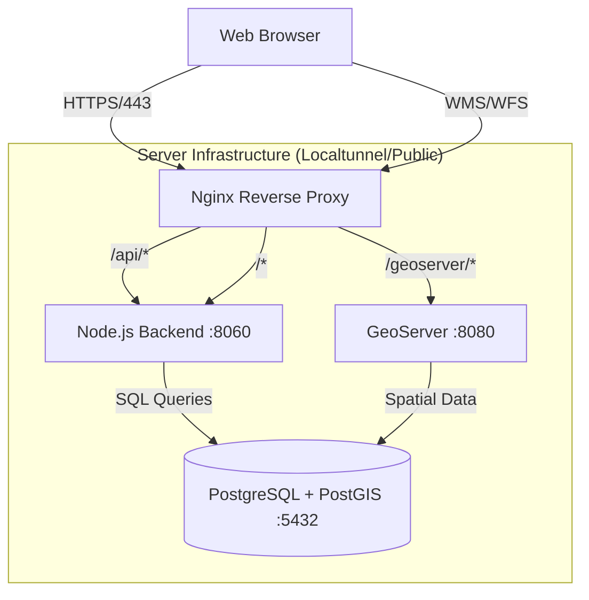

# URIDA Geo Portal - Comprehensive Technical Documentation

## 1. System Architecture Analysis

### Overview
The URIDA Geo Portal is a web-based GIS application designed to visualize and manage urban infrastructure data (roads, amenities, wards) for various cities in Uttar Pradesh. The system utilizes a modern web stack with a React frontend, Node.js backend, PostgreSQL/PostGIS database, and GeoServer for map tile serving.

### Technology Stack
| Component | Technology | Version | Description |
|-----------|------------|---------|-------------|
| **Frontend** | React | 18.x/19.x | Single Page Application (SPA) using OpenLayers for mapping. |
| **Backend** | Node.js (Express) | 16+ | RESTful API server handling business logic and auth. |
| **Database** | PostgreSQL + PostGIS | 13+ | Relational database with geospatial extensions. |
| **Map Server** | GeoServer | 2.x | OGC compliant server for WMS/WFS map tiles. |
| **Web Server** | Nginx | 1.18+ | Reverse proxy, SSL termination, and static file serving. |
| **Tunneling** | LocalTunnel | - | Exposes local development server to public internet. |
| **Process Manager** | PM2 (Recommended) | - | Node.js process manager for production. |

### Architecture Diagram (Logical)


### Component Communication
1.  **Client -> Nginx**: All external traffic hits Nginx on port 80/443.
2.  **Nginx -> Node.js**: Requests to `/api` and the root `/` (serving React app) are proxied to `http://localhost:8060`.
3.  **Nginx -> GeoServer**: Requests to `/geoserver` are proxied to `http://localhost:8080/geoserver`.
4.  **Node.js -> PostgreSQL**: Backend connects via TCP to `162.245.218.6:5432` using `pg` pool.
5.  **GeoServer -> PostgreSQL**: GeoServer connects directly to the database to render map tiles.

---

## 2. Infrastructure Documentation

### Nginx Configuration
Located at `/etc/nginx/sites-enabled/default`.
*   **Ports**: Listens on 80 (HTTP) and 443 (HTTPS).
*   **SSL**: Certificates located at `/etc/nginx/ssl/urida_geodirectory.crt` and `.key`.
*   **Proxy Rules**:
    *   `location /`: Proxies to `http://localhost:8060`. Sets headers for WebSocket upgrade.
    *   `location /geoserver`: Proxies to `http://localhost:8080/geoserver`. Adds CORS headers (`Access-Control-Allow-Origin: *`).

### PM2 Configuration (Recommended)
A `ecosystem.config.js` file has been created in the project root to manage services.
```javascript
module.exports = {
  apps: [
    {
      name: "urida-backend",
      script: "./server/src/server.js",
      cwd: "/var/www/urida_prod",
      instances: 1,
      autorestart: true,
      env: { NODE_ENV: "production", PORT: 8060 }
    },
    {
      name: "urida-localtunnel",
      script: "/usr/bin/lt",
      args: "--port 80 --subdomain prod-uridageo-rsac"
    }
  ]
};
```

### Environment Variables
**File**: `server/.env`
*   `PORT`: 8060
*   `DB_HOST`: 162.245.218.6
*   `DB_PORT`: 5432
*   `DB_USER`: postgres
*   `DB_PASS`: [REDACTED]
*   `DB_NAME`: All_DB
*   `JWT_SECRET`: [REDACTED]

---

## 3. Codebase Analysis

### Backend (`/server`)
*   **Entry Point**: `src/server.js` starts the Express app defined in `src/app.js`.
*   **Key Directories**:
    *   `src/config/`: Configuration files. `cityConfig.js` is critical for mapping city names (e.g., 'agra') to database schemas.
    *   `src/controllers/`: Business logic. `cityController.js` handles city-specific data retrieval.
    *   `src/routes/`: API route definitions (`authRoutes.js`, `cityRoutes.js`).
    *   `src/middleware/`: Auth verification (`authMiddleware.js`) and logging.
*   **Dynamic Schema Mapping**: The application supports multiple cities by dynamically selecting the schema based on the request.
    *   Example: `getRoadTable('agra')` returns `agra.agra_road_net`.

### Frontend (`/client`)
*   **Framework**: React 18+.
*   **Routing**: `react-router-dom`. Routes: `/` (Login), `/home`, `/dashboard`.
*   **Mapping Library**: OpenLayers (`ol`) with `ol-geocoder` and `ol-layerswitcher`.
*   **State Management**: Local component state (implied) and Context (likely).
*   **Build**: Uses `react-scripts`. Production build is served by the backend's static file middleware.

### Database Schema Strategy
*   **Database**: `All_DB`
*   **Schemas**: One schema per city (e.g., `agra`, `kanpur`, `lucknow`).
*   **Common Tables (per schema)**:
    *   `{city}_road_net`: Road network geometries and attributes.
    *   `{city}_ward_boundary`: Ward boundaries.
    *   `{city}_zone_boundary`: Zone boundaries.
    *   `{city}_amenities`: Various amenity tables (schools, hospitals, etc.).

---

## 4. Operational Runbooks

### Service Startup
**Using PM2 (Recommended)**:
```bash
cd /var/www/urida_prod
pm2 start ecosystem.config.js
pm2 save
```

**Manual Startup**:
```bash
# Start Backend
cd /var/www/urida_prod
node server/src/server.js &

# Start Tunnel (if needed)
lt --port 80 --subdomain prod-uridageo-rsac &
```

### Service Shutdown
```bash
pm2 stop all
# Or manually kill processes
pkill -f "node server/src/server.js"
```

### Troubleshooting
*   **502 Bad Gateway**: Check if Node.js backend is running (`pm2 status` or `ps aux | grep node`). Check if Nginx is running (`systemctl status nginx`).
*   **Database Connection Error**: Verify `DB_HOST` is reachable. Check firewall rules on 162.245.218.6.
*   **Map Tiles Not Loading**: Check GeoServer status (`curl http://localhost:8080/geoserver/web/`).

### Scaling
*   **Vertical Scaling**: Increase server RAM/CPU.
*   **Horizontal Scaling**: Use Nginx load balancing (requires multiple Node instances, though `server.js` is currently single-threaded). PM2 `instances: 'max'` can utilize multi-core.

### Backup and Recovery
**Database Backup**:
The system uses PostgreSQL. Regular backups should be performed using `pg_dump`.
```bash
# Backup all databases
pg_dumpall -h 162.245.218.6 -U postgres -f /var/www/backups/urida_db_$(date +%F).sql
```
*Note: Ensure `.pgpass` is configured for passwordless auth.*

**File Backup**:
Backup the application code and uploaded files.
```bash
tar -czvf /var/www/backups/urida_code_$(date +%F).tar.gz /var/www/urida_prod
```

**Recovery**:
1.  **Database**: `psql -h 162.245.218.6 -U postgres -f backup_file.sql`
2.  **Files**: Extract the tarball to the web directory.

---

## 5. Developer Documentation

### Local Development Setup
1.  **Clone Repository**:
    ```bash
    git clone <repo_url>
    cd urida_prod
    ```
2.  **Install Dependencies**:
    ```bash
    cd server && npm install
    cd ../client && npm install
    ```
3.  **Environment Setup**:
    Copy `.env.example` to `server/.env` and fill in DB credentials.
4.  **Run Development Servers**:
    *   Backend: `cd server && npm run dev` (Runs on 8060)
    *   Frontend: `cd client && npm start` (Runs on 3000)

### API Documentation
**Base URL**: `/api`

| Method | Endpoint | Description | Auth Required |
|--------|----------|-------------|---------------|
| POST | `/auth/login` | Authenticate user | No |
| GET | `/auth/profile` | Get current user info | Yes |
| GET | `/city/:city/zones` | Get zone summary | Yes |
| GET | `/city/:city/wards` | Get ward summary | Yes |
| GET | `/road-networks` | Search/Filter roads | Yes |

---

## 6. User Documentation

### Features
*   **Dashboard**: View city-wide statistics for road networks, amenities, and infrastructure.
*   **Interactive Map**: Layer control for roads, wards, zones, and amenities.
*   **Filtering**: Advanced filtering by road length, material, condition, and ownership.
*   **Reporting**: Export data tables and summaries.

### Common Workflows
1.  **Login**: Enter credentials at the login screen.
2.  **Select City**: Choose a city from the dropdown (if applicable) or navigate via map.
3.  **View Road Details**: Click on a road segment to view attributes (length, width, condition).
4.  **Filter Data**: Use the sidebar to filter roads by "Poor" condition to identify maintenance needs.

---

## 7. Change Tracking & Versioning

### Version Control
*   This documentation is version 1.0.0.
*   All code changes are tracked via Git.
*   Major configuration changes (Nginx, Env) should be documented in `CHANGELOG.md`.

### Change Log (Example)
*   **v1.0.0 (2026-02-24)**: Initial comprehensive documentation. Created `ecosystem.config.js`.

---

## 8. Monitoring & Security

### Monitoring
*   **Health Checks**:
    *   Backend: `GET /` (Returns React app or 200 OK).
    *   GeoServer: `GET /geoserver/web/`.
*   **Logs**:
    *   Nginx: `/var/log/nginx/access.log`, `/var/log/nginx/error.log`.
    *   Node App: PM2 logs (`~/.pm2/logs`) or stdout.

### Security Configurations
*   **SSL/TLS**: Enforced by Nginx (Redirects HTTP to HTTPS).
*   **Authentication**: JWT (JSON Web Tokens) with secure signing.
*   **CORS**: Restricted to specific origins in `app.js` (localhost, production domains).
*   **Helmet**: HTTP headers security enabled in Express.
*   **Rate Limiting**: Enabled for Auth routes (100 requests per 10 mins).
